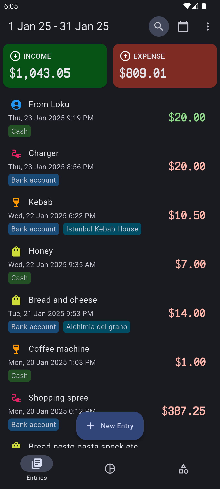
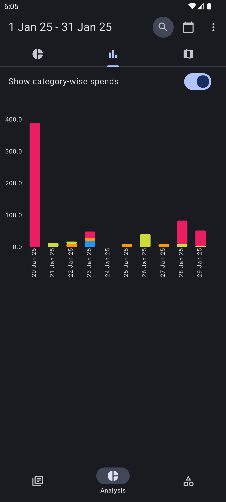
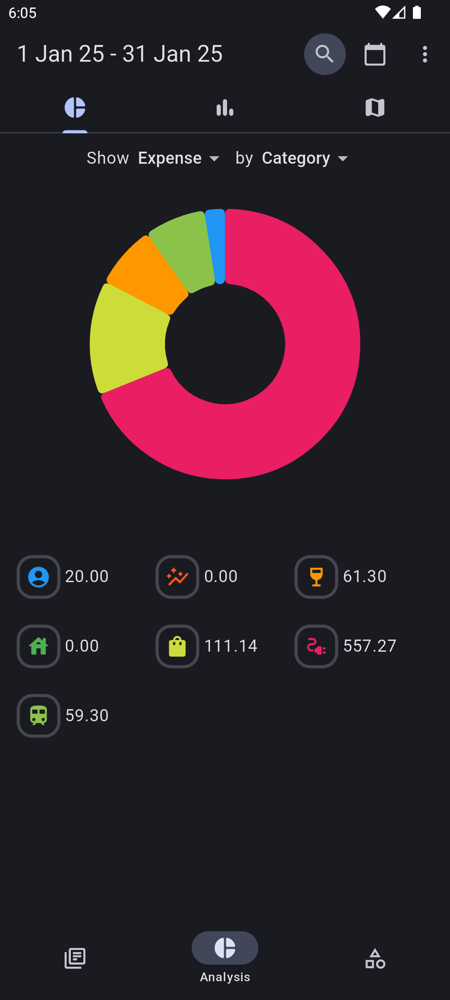
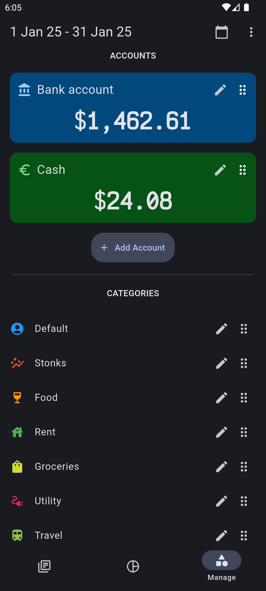

    
    <h1 align="center">Moniz</h1>

  
    
    
  

A simple app for keeping track of where you've spent your money.

### Screenshots

|                                               |                                               |
| :-------------------------------------------: | :-------------------------------------------: |
|  |  |
|  |  |
